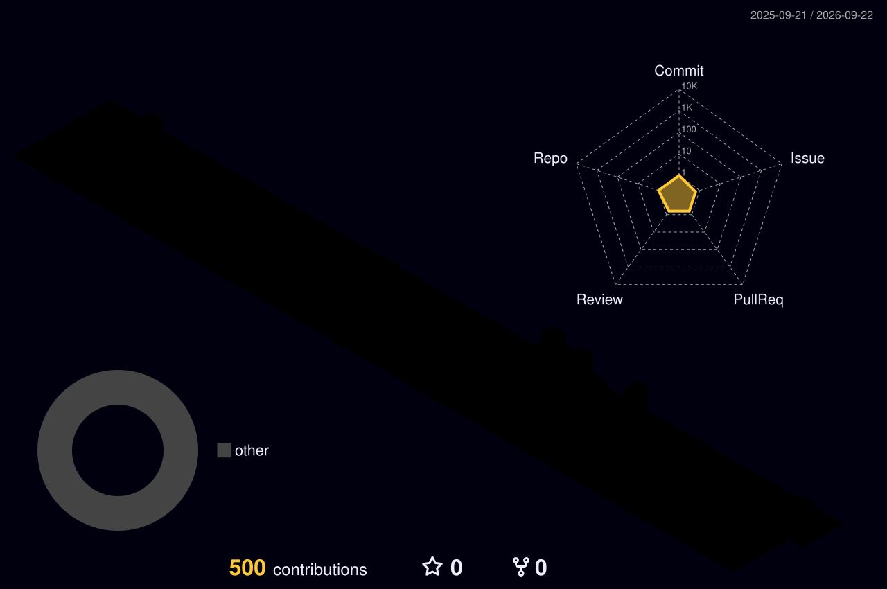

# Felipe Seabra

**Full-Stack Developer · Frontend-focused**

I build modern web applications with **React, Next.js and TypeScript**, with a strong focus on frontend architecture, usability and clean interfaces.

## Tech Stack

  

## GitHub Activity

  

  
  

  

## Development

<table><tr><td><strong>Frontend</strong></td><td>React · Next.js · TypeScript · Tailwind CSS</td></tr><tr><td><strong>Backend</strong></td><td>Node.js · Supabase · PostgreSQL · APIs</td></tr><tr><td><strong>Architecture</strong></td><td>Server Components · Server Actions · REST · RLS</td></tr><tr><td><strong>UI/UX</strong></td><td>Responsive UI · Accessibility · UX · Framer Motion</td></tr><tr><td><strong>Tools</strong></td><td>Git · GitHub · Docker · Vercel · Postman</td></tr></table>

## Connect

  

